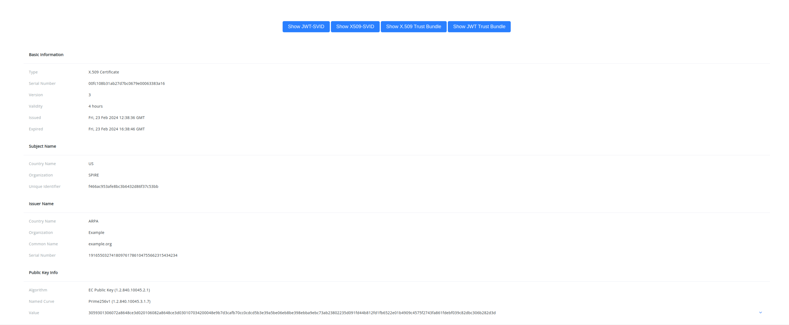

# Tutorial SPIFFE SPIRE Kubernetes

<p align="center">
  
  
  
</p>

> **Note:** Looking for the English version of this tutorial? [Click here](README_en.md)

[SPIFFE](https://spiffe.io/) e [SPIRE](https://spiffe.io/) são projetos open-source mantidos pela [CNCF](https://www.cncf.io/) que oferecem uma maneira segura e padronizada
de distribuição de identidades para workloads em ambientes heterogêneos e dinâmicos.

- **SPIFFE** (Secure Production Identity Framework For Everyone) é uma especificação que define um conjunto de padrões para definir, distribuir e emitir identidades.
- **SPIRE** (SPIFFE Runtime Environment) é uma implementação open-source de referência do SPIFFE que oferece suporte a várias plataformas e ambientes, incluindo Kubernetes, VMs e bare-metal.

Este tutorial irá guiá-lo através do processo de deploy do SPIRE em um cluster Kubernetes (kind) e usá-lo para emitir e gerenciar identidades SPIFFE para workloads em execução no cluster.

Este é um tutorial avançado para implantar o SPIRE em um ambiente Kubernetes, se você acabou de começar a aprender sobre
SPIRE, eu recomendo que você comece com o [guia de introdução ao SPIRE](https://spiffe.io/docs/latest/try/getting-started-linux-macos-x/) e
depois volte para este tutorial.

Não se esqueça de verificar estes outros repositórios com tutoriais e exemplos incríveis para explorar outros casos de uso do SPIFFE/SPIRE
como **integração com service meshes**, **bancos de dados**, **OIDC**, **federation** e mais!
- https://github.com/spiffe/spire-tutorials
- https://github.com/spiffe/spire-examples

> Caso esteja pensando em utilizar o **SPIFFE** em seus sistemas, não deixe de conferir também o incrível trabalho que estamos fazendo na [SPIRL](https://www.spirl.com/),
uma implementação comercial do SPIFFE que oferece suporte e recursos enterprise adicionais para empresas que desejam adotar o SPIFFE em seus sistemas sem o overhead
de manter e gerenciar a infraestrutura do SPIRE.

## Objetivos de Aprendizado
Após completar este tutorial, você terá:
- Um Cluster Kubernetes rodando no kind.
- Componentes do SPIRE implantados no cluster Kubernetes.
- Duas cargas de trabalho (cliente e servidor) rodando e se comunicando entre si usando mTLS com SVIDs emitidos pelo SPIRE.
- Um aplicativo de demonstração que expõe os dados da Workload API em uma interface de usuário web para que você possa explorar certificados x509, tokens JWT e Trust Bundles.
Todos os passos estão contidos nos scripts deste repositório, apenas executando os scripts tudo deverá ser configurado para você. 
Eu recomendo fortemente que você leia os scripts e entenda o que cada passo está fazendo, não há nenhuma mágica aqui :)

## Requisitos
- [kind](https://kind.sigs.k8s.io/docs/user/quick-start/)
- [kubectl](https://kubernetes.io/docs/tasks/tools/install-kubectl/)
- [helm](https://helm.sh/docs/intro/install/)
- [docker](https://docs.docker.com/get-docker/)

## Arquitetura

### Componentes SPIRE

Existem várias maneiras de implantar e executar o SPIRE em um cluster Kubernetes. Neste tutorial, fazemos uso dos seguintes projetos para
facilitar a implantação e o gerenciamento do SPIRE em um cluster Kubernetes.
- [spire-controller-manager](https://github.com/spiffe/spire-controller-manager): Usado para registro automático de identidades.
- [spire-helm-charts](https://github.com/spiffe/helm-charts-hardened): Usado para deploy de componentes SPIRE no cluster Kubernetes.
- [spiffe-csi](https://github.com/spiffe/spiffe-csi/tree/main): Usado para expor a Workload API em cada pod sem usar o hostPath volume.

Note que você não precisa desses projetos para executar o SPIRE no Kubernetes, mas eles são altamente recomendados, pois foram construídos pela comunidade para
uso em ambientes de produção.

Abaixo você pode encontrar um diagrama do que está sendo implantado no cluster sob o namespace `spire-system`:
- [spire-server](https://spiffe.io/docs/latest/spire-about/spire-concepts/#all-about-the-server): Implantado como um STS ao lado do contêiner spire-controller-manager.
- [spire-agent](https://spiffe.io/docs/latest/spire-about/spire-concepts/#all-about-the-agent): Implantado como um DaemonSet em cada nó do cluster.
- custom resources definitions: CRDs usados pelo spire-controller-manager para facilitar o registro de workloads.
- spire-spiffe-csi-driver: Implantado como um DaemonSet em cada nó do cluster para montar volumes da Workload API.


### Componentes de Workloads

Neste tutorial, usamos a aplicação `greeter` que pode ser encontrado no diretório `greeter`.
A aplicação greeter dispõe de um cliente e servidor que implementam o [exemplo de serviço hello world do gRPC](https://github.com/grpc/grpc-go/tree/master/examples).

O `hello world` é um serviço simples que retorna uma saudação ao cliente que o chama.

A ideia para o serviço greeter é demonstrar como reaver SVIDs da Workload API e usá-los para autenticar e autorizar a comunicação entre o cliente e o servidor.

Tanto o cliente quanto o servidor fazem uso da biblioteca [go-spiffe](https://github.com/spiffe/go-spiffe) para interagir com a Workload API e estabelecer uma conexão [mTLS](https://www.cloudflare.com/learning/access-management/what-is-mutual-tls/) entre eles.


> **Nota:**: O passo 5 descrito abaixo é um extra para deployar o spiffe-demo-app para que você possa visualizar todos os dados expostos pela Workload API em uma interface de usuário web.

### Como as workloads obtêm seus SVIDs
Se você está usando o SPIRE sem o gerenciador de controle, você precisa passar pelo processo de [registro de identidade de workload](https://spiffe.io/docs/latest/deploying/registering/)
antes que suas workloads atestadas possam obter suas identidades.

Neste exemplo, estamos usando o spire-controller-manager com [ClusterSPIFFEID CR](https://github.com/spiffe/spire-controller-manager?tab=readme-ov-file#clusterspiffeid) para definir um
modelo para registrar automaticamente workloads **atestadas** com o SPIRE.

Este é o modelo que é usado em conjunto com [k8s workload attestor](https://github.com/spiffe/spire/blob/v1.8.7/doc/plugin_agent_workloadattestor_k8s.md):

`spiffe://{{ .TrustDomain }}/ns/{{ .PodMeta.Namespace }}/sa/{{ .PodSpec.ServiceAccountName }}`


### Passos de Deploy

0. Verificando requisitos.
   Este script verificará todas as ferramentas e dependências necessárias para executar o tutorial.
```bash
./0-check-requirements.sh
```

1. Criar um cluster kind.
   O segundo script criará um contêiner de registro para armazenar as imagens do serviço greeter.
   Ele também cria um cluster kind com dois nós.
```bash
./1-create-cluster.sh
```

2. Deploy do dos workloads de demonstração sem SPIFFE.
   Este script irá buildar e fazer o deploy do servidor greeter e o cliente no namespace "workload", por enquanto sem SPIFFE.
```bash
./2-install-demo-app.sh
```

3. Verificar comunicação entre workloads.
   Este script verificará que o cliente greeter pode se comunicar com o servidor greeter.
```bash
./3-verify-demo-workloads.sh
```
Se tudo estiver funcionando corretamente, você deverá ver a seguinte saída:
```bash
---- Client logs ----
2025/01/29 15:50:50 Starting up...
2025/01/29 15:50:50 SPIFFE config disabled
2025/01/29 15:50:50 Server Address: greeter-server.workload.svc.cluster.local:8443
2025/01/29 15:50:50 Making SayHello requests every 1s...
2025/01/29 15:50:52 SOME-SERVER-ID said "Hello, SOME-CLIENT-ID!"
2025/01/29 15:50:53 SOME-SERVER-ID said "Hello, SOME-CLIENT-ID!"
2025/01/29 15:50:54 SOME-SERVER-ID said "Hello, SOME-CLIENT-ID!"
2025/01/29 15:50:55 SOME-SERVER-ID said "Hello, SOME-CLIENT-ID!"

---- Server logs ----
2025/01/29 15:50:50 Starting up...
2025/01/29 15:50:50 SPIFFE config disabled
2025/01/29 15:50:50 Serving on [::]:8443
2025/01/29 15:50:52 SOME-CLIENT-ID said hello "Server"
2025/01/29 15:50:53 SOME-CLIENT-ID said hello "Server"
2025/01/29 15:50:54 SOME-CLIENT-ID said hello "Server"
2025/01/29 15:50:55 SOME-CLIENT-ID said hello "Server"
```

Agora você pode também acessart o KubeShark para analisar o tráfego entre os workloads:
```bash
kubectl port-forward service/kubeshark-front 8899:80
```

Acesse http://localhost:8899 e veja que o tráfego entre os workloads está sem criptografia, no
qual é possivel ver o conteúdo da mensagem enviada.

4. Deploy do SPIRE.
   Este script irá fazer o deploy os componentes spire no cluster kind usando o helm chart spire.
```bash
./4-install-spire.sh
```

5. Atualizar workloads para utilizar identidades SPIFFE.
   Este script irá atualizar os workloads greeter para consumir identidades SPIFFE emitidas pelo SPIRE e se comunicar entre si usando mTLS.
```bash
./5-update-workloads-to-be-spiffe-aware.sh
```

6. Verificar que tudo está funcionando.
   Este script verificará que o cliente greeter pode se comunicar com o servidor greeter usando os SVIDs emitidos pelo SPIRE.
   Você poderá esperar alguns segundos para que os workloads sejam atestados e obtenham seus SVIDs.
```bash
./6-verify-demo-workloads.sh
```
 Se tudo estiver funcionando corretamente, você deverá ver a seguinte saída:
```bash
---- Client logs ----
2025/01/29 15:54:59 Starting up...                                                                                                                      
2025/01/29 15:54:59 SPIFFE config enabled, setting up mTLS                                                                                              
2025/01/29 15:54:59 Connecting to Workload API at "unix:///spiffe-workload-api/spire-agent.sock"...                                                     
2025/01/29 15:55:14 Connected to Workload API at "unix:///spiffe-workload-api/spire-agent.sock"                                                         
2025/01/29 15:55:14 SPIFFE ID: "spiffe://cloudnative.br.sp/ns/workload/sa/greeter-client-sa"                                                            
2025/01/29 15:55:14 Server Address: greeter-server.workload.svc.cluster.local:8443                                                                      
2025/01/29 15:55:14 Making SayHello requests every 1s...  
2025/01/29 15:55:21 spiffe://cloudnative.br.sp/ns/workload/sa/greeter-server-sa said "Hello, spiffe://cloudnative.br.sp/ns/workload/sa/greeter-client-sa!"
2025/01/29 15:55:22 spiffe://cloudnative.br.sp/ns/workload/sa/greeter-server-sa said "Hello, spiffe://cloudnative.br.sp/ns/workload/sa/greeter-client-sa!"
2025/01/29 15:55:23 spiffe://cloudnative.br.sp/ns/workload/sa/greeter-server-sa said "Hello, spiffe://cloudnative.br.sp/ns/workload/sa/greeter-client-sa!"
2025/01/29 15:55:24 spiffe://cloudnative.br.sp/ns/workload/sa/greeter-server-sa said "Hello, spiffe://cloudnative.br.sp/ns/workload/sa/greeter-client-sa!"

---- Server logs ----
2025/01/29 15:54:59 Starting up...
2025/01/29 15:54:59 SPIFFE config enabled, setting up mTLS
2025/01/29 15:54:59 Connecting to Workload API at "unix:///spiffe-workload-api/spire-agent.sock"...
2025/01/29 15:55:20 Connected to Workload API at "unix:///spiffe-workload-api/spire-agent.sock"
2025/01/29 15:55:20 SPIFFE ID: "spiffe://cloudnative.br.sp/ns/workload/sa/greeter-server-sa"
2025/01/29 15:55:20 Serving on [::]:8443
2025/01/29 15:55:21 spiffe://cloudnative.br.sp/ns/workload/sa/greeter-client-sa said hello "Server"
2025/01/29 15:55:22 spiffe://cloudnative.br.sp/ns/workload/sa/greeter-client-sa said hello "Server"
2025/01/29 15:55:23 spiffe://cloudnative.br.sp/ns/workload/sa/greeter-client-sa said hello "Server"
2025/01/29 15:55:24 spiffe://cloudnative.br.sp/ns/workload/sa/greeter-client-sa said hello "Server"
```
Se você ver a saída acima, significa que tanto o cliente quanto o servidor foram atestados pelo SPIRE, receberam seus SVIDs e estão se comunicando entre si usando mTLS.

Você pode novamente acessar o KubeShark para analisar o tráfego entre os workloads:
```bash
kubectl port-forward service/kubeshark-front 8899:80
```
Acesse http://localhost:8899 e veja que o tráfego entre os workloads está criptografado

> Para visualizar os pacotes, agora você precisará habilirtar o TCP e TLSX Protocl Dissectors no KubeShark.

7. Extra: Explorando a Workload API com Web UI.
Este script fará o deploy do spiffe-demo-app no namespace "spiffe-demo" e irá export um app web com port forwarding na localhost:8080. 
O spiffe-demo-app é uma interface de usuário web que permite visualizar os dados expostos pela Workload API, incluindo SVIDs de certificado x509, SVIDs JWT e trust bundle.

```bash
./7-extra-spiffe-demo-app.sh
```
Agora vá para http://localhost:8080 em seu navegador para explorar a Workload API:


8. Limpando o ambiente.
   Este script limpará o cluster kind e o contêiner de registro.
```bash
./6-clean-up.sh
```

## Próximos Passos
Parabéns! agora você tem um ambiente de trabalho com o SPIRE implantado em um cluster Kubernetes e workloads atestadas se comunicando entre si usando mTLS!

O mundo do SPIFFE e SPIRE é extremamente vasto, e neste tutorial exploramos apenas alguns use-cases. Confira os links abaixo para mais recursos adicionais
e os links no início deste tutorial para mais exemplos e tutoriais como **integração com service meshes**, **bancos de dados**, **OIDC**, **federation** e mais!

Sinta-se à vontade para se [envolver com a comunidade](https://spiffe.io/docs/latest/spiffe-about/get-involved/). Caso
tenha dúvidas ou queira compartilhar suas experiências, a comunidade está sempre disposta a ajudar, entre no [canal do Slack](https://slack.spiffe.io/) e participe das discussões.

## Referências e Recursos Adicionais
Caso você deseja saber mais sobre o SPIFFE e SPIRE, aqui estão alguns links:
- [SPIFFE](https://spiffe.io/): Site oficial do projeto SPIFFE.
- [SPIRE](https://spiffe.io/docs/latest/spire-about/): Site oficial do projeto SPIRE.
- [Awesome SPIFFE SPIRE](https://github.com/elinesterov/awesome-spiffe-spire): Repo com diversos links de vídeos e artigos sobre o assunto.
- [Solving The Bottom Turtle Problem](https://spiffe.io/pdf/Solving-the-bottom-turtle-SPIFFE-SPIRE-Book.pdf): Livro sobre SPIFFE e SPIRE.
- [Episódio que participei no Kubicast da Getup](https://www.youtube.com/watch?v=5zq7EPHDbWc): Falamos sobre SPIFFE, SPIRE: história e use cases.

## Trabalho Futuro
- Adicionar exemplo de Federaçao entre trust domains.
- Adicionar exemplo com Nested SPIRE.
