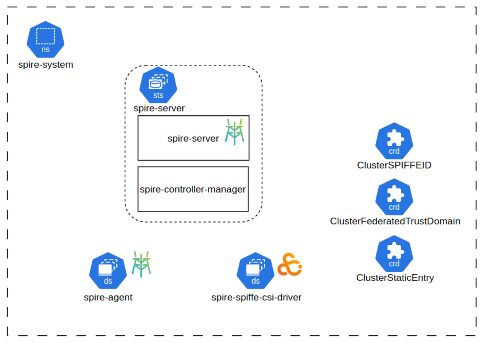
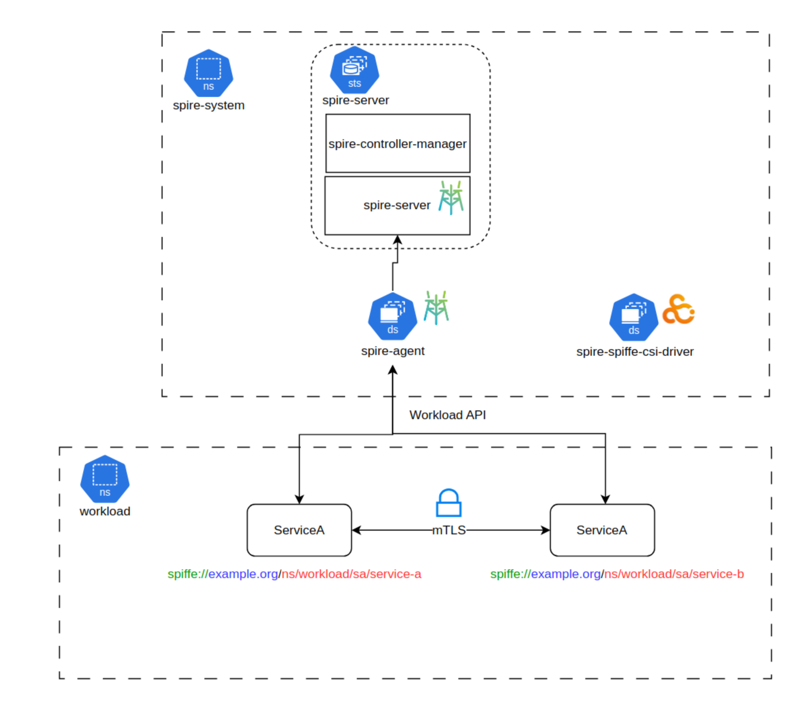
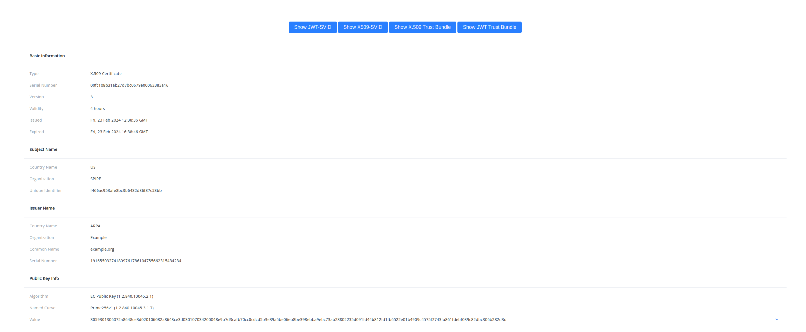

# SPIFFE SPIRE Kubernetes Tutorial

> **Note:** Procurando pela versão em português deste tutorial? [Clique aqui](README.md)

[SPIFFE](https://spiffe.io/) and [SPIRE](https://spiffe.io/) are open-source projects maintained by the [CNCF](https://www.cncf.io/) that offer a secure and standardized
way of distributing identities for workloads in heterogeneous and dynamic environments.

- **SPIFFE** (Secure Production Identity Framework For Everyone) is a specification that defines a set of standards for defining, distributing, and issuing identities.
- **SPIRE** (SPIFFE Runtime Environment) is an open-source reference implementation of SPIFFE that supports multiple platforms and environments, including Kubernetes, VMs, and bare-metal.

This tutorial will guide you through the process of deploying SPIRE on a Kubernetes cluster (kind) and using it to issue and manage SPIFFE identities for workloads running on the cluster.

This is an advanced tutorial for deploying SPIRE in a Kubernetes environment, if you just started learning about
SPIRE, I recommend you to start with the [SPIRE getting started guide](https://spiffe.io/docs/latest/try/getting-started-linux-macos-x/) and
then come back to this tutorial.

Don't forget to check these other repos with awesome tutorials and examples for exploring other use cases of SPIFFE/SPIRE
such as **integrating with service meshes**, **databases**, **using OIDC**, **federation** and more!
- https://github.com/spiffe/spire-tutorials
- https://github.com/spiffe/spire-examples

> If you are considering using **SPIFFE** in your systems, be sure to also check out the incredible work we are doing at [SPIRL](https://www.spirl.com/),
a commercial implementation of SPIFFE that offers additional enterprise support and resources for companies that want to adopt SPIFFE in their systems without the overhead
of maintaining and managing the SPIRE infrastructure.

## Learning Outcomes
After completing this tutorial, you will have:
- A Kubernetes Cluster running on kind.
- SPIRE components deployed on the Kubernetes cluster.
- Two workloads (client and server) running and talking to each other using mTLS using SVIDs issued by SPIRE.
- A demo app that exposes the Workload API data in a web UI so you can explore x509 certificates, JWT tokens and Trust Bundles.

All the steps are contained in the scripts in this repository, just running the scripts should put everything in place for you.
I highly recommend that you read the scripts and understand what each step is doing, there's no magic here :)

## Requirements
- [kind](https://kind.sigs.k8s.io/docs/user/quick-start/)
- [kubectl](https://kubernetes.io/docs/tasks/tools/install-kubectl/)
- [helm](https://helm.sh/docs/intro/install/)
- [docker](https://docs.docker.com/get-docker/)

## Architecture

### SPIRE Components

There is several ways for deploying and running SPIRE on a Kubernetes cluster. In this tutorial, we make use of the following projects to
facilitate the deployment and management of SPIRE on a Kubernetes cluster. 
- [spire-controller-manager](https://github.com/spiffe/spire-controller-manager): Used for automatic identity registration.
- [spire-helm-charts](https://github.com/spiffe/helm-charts-hardened): Used for deploying SPIRE components on the Kubernetes cluster.
- [spiffe-csi](https://github.com/spiffe/spiffe-csi/tree/main): Used for exposing Workload API in each pod without using hostPath volume.

Note that you don't require these projects for running SPIRE in Kubernetes, but they are highly recommended as they were built by the community for
usage in production environments.

Below you can find a diagram of what is getting deployed on the cluster under the `spire-system` namespace:
- [spire-server](https://spiffe.io/docs/latest/spire-about/spire-concepts/#all-about-the-server): Deployed as an STS alongside the spire-controller-manager container
- [spire-agent](https://spiffe.io/docs/latest/spire-about/spire-concepts/#all-about-the-agent): Deployed as a DaemonSet on every node in the cluster.
- custom resouce definitions: CRDs used by spire-controller-manager to facilitate workload registration
- spire-spiffe-csi-driver: Deployed as a DaemonSet on every node in the cluster for mounting Workload API volumes.



### Workload Components

In this tutorial we use the greeter application that can be found in the `greeter` directory. 
The greeter application disposes of a client and server that implements the gRPC [hello world service example](https://github.com/grpc/grpc-go/tree/master/examples).

The hello world service is a simple service that returns a greeting back to the client who calls it.

The idea for the greeter service is to demonstrate how to retrieve SVIDs from the Workload API and use them to authenticate and authorize the communication between the client and server.

Both the client and server makes usage of the [go-spiffe](https://github.com/spiffe/go-spiffe) library to interact with the Workload API and to establish an [mTLS connection](https://www.cloudflare.com/learning/access-management/what-is-mutual-tls/) between them.



> **Note:** The step 5 described below is an extra for deploying the [spiffe-demo-app](https://github.com/elinesterov/spiffe-demo-app) so you can visualize
> all the data that's exposed by the Workload API in a web UI.


### How workloads get their SVIDs
If you are using SPIRE without the controller manager, you need to go through [workload identity registration] process (https://spiffe.io/docs/latest/deploying/registering/)
before your attested workloads can get their identities. 

In this example we are using spire-controller-manager with [ClusterSPIFFEID CR](https://github.com/spiffe/spire-controller-manager?tab=readme-ov-file#clusterspiffeid) to define a
template for automatically registering **attested** workloads with SPIRE.

This is the template that is used in conjunction with [k8s workload attestor](https://github.com/spiffe/spire/blob/v1.8.7/doc/plugin_agent_workloadattestor_k8s.md):

`spiffe://{{ .TrustDomain }}/ns/{{ .PodMeta.Namespace }}/sa/{{ .PodSpec.ServiceAccountName }}`


### Deployment Steps

0. Checking requirements.
This script will check for all required tools and dependencies to run the tutorial.
```bash
./0-check-requirements.sh
```

1. Create a kind cluster.
The second script will create a registry container for storing the greeter service images.
It also creates a kind cluster with two nodes.
```bash
./1-create-kind-cluster.sh
```

2. Deploy the SPIRE components.
This script will deploy the spire components on the kind cluster using the spire helm chart.
```bash
./2-deploy-spire.sh
```

3. Deploy demo workloads.
This script will build and deploy the greeter server and client int the "workload" namespace.
```bash
./3-deploy-demo-workloads.sh
```

4. Verify that everything is working.
This script will verify that the greeter client can communicate with the greeter server using the SVIDs issued by SPIRE.
You may need to wait a few seconds for the workloads to get their SVIDs and start communicating.
```bash
./4-verify-demo-workloads.sh
```

If everything is working, you should see the following output:
```bash
---- Client logs ----
2024/02/23 03:03:31 Starting up...
2024/02/23 03:03:31 Server Address: greeter-server.workload.svc.cluster.local:8443
2024/02/23 03:03:31 Connecting to Workload API at "unix:///spiffe-workload-api/spire-agent.sock"...
2024/02/23 03:03:37 Connected to Workload API at "unix:///spiffe-workload-api/spire-agent.sock"
2024/02/23 03:03:37 SPIFFE ID: "spiffe://example.org/ns/workload/sa/greeter-client-sa"
2024/02/23 03:03:37 Issuing requests every 30s...
2024/02/23 03:03:37 spiffe://example.org/ns/workload/sa/greeter-server-sa said "On behalf of spiffe://example.org/ns/workload/sa/greeter-client-sa, hello Joe!"

---- Server logs ----
2024/02/23 03:02:32 Starting up...
2024/02/23 03:02:32 Connecting to Workload API at "unix:///spiffe-workload-api/spire-agent.sock"...
2024/02/23 03:02:36 Connected to Workload API at "unix:///spiffe-workload-api/spire-agent.sock"
2024/02/23 03:02:36 SPIFFE ID: "spiffe://example.org/ns/workload/sa/greeter-server-sa"
2024/02/23 03:02:36 Serving on [::]:8443
2024/02/23 03:03:37 spiffe://example.org/ns/workload/sa/greeter-client-sa has requested that I say say hello to "Joe"...
```

If you see the output above, it means that the both the client and server were attested by SPIRE, received their SVIDs
and are communicating with each other using mTLS.

5. Extra: Deploy the spiffe-demo-app to explore Workload API in a web UI.
This script will deploy the spiffe-demo-app in the "spiffe-demo" namespace and expose it via port forwarding in `localhost:8080`.
The spiffe-demo-app is a web UI that allows you to visualize the data exposed by the Workload API, including x509 certificate SVIDs, JWT SVIDs and trust bundle.
```bash
./5-extra-spiffe-demo-app.sh
```
Now go to `http://localhost:8080` in your browser to explore SVIDs and trust bundles:




6. Clean up.
This script will clean up the kind cluster and the registry container.
```bash
./6-clean-up.sh
```

## Next Steps
Congratulations! Now you have a working environment with SPIRE deployed on a Kubernetes cluster and attested workloads 
communicating with each other using mTLS!  

The world of SPIFFE and SPIRE is extremely vast, and in this tutorial we have explored only a few use-cases. 
Check out the links below for more additional resources and the links at the beginning of this tutorial for more examples and tutorials 
like integration with service meshes, databases, OIDC, federation and more!  

Feel free to [get involved with the community](https://spiffe.io/docs/latest/spiffe-about/get-involved/). If you have questions or want to share your experiences, the community is always willing to help, join the [Slack channel](https://slack.spiffe.io/) and participate in the discussions.

## References and Additional Resources
If you want to know more about SPIFFE and SPIRE, here are some links:
- [SPIFFE Website](https://spiffe.io/): Official website with all the information about SPIFFE.
- [SPIRE Repository](https://github.com/spiffe/spire): Official SPIRE repository.
- [Awesome SPIFFE SPIRE](https://github.com/elinesterov/awesome-spiffe-spire): Repo with various links to videos and articles on the subject.
- [Solving The Bottom Turtle Problem](https://spiffe.io/pdf/Solving-the-bottom-turtle-SPIFFE-SPIRE-Book.pdf): Book about SPIFFE and SPIRE.
- [Episode I participated in at Getup's Kubicast (Portuguese Only)](https://www.youtube.com/watch?v=5zq7EPHDbWc): We talked about SPIFFE, SPIRE: history and use cases.
